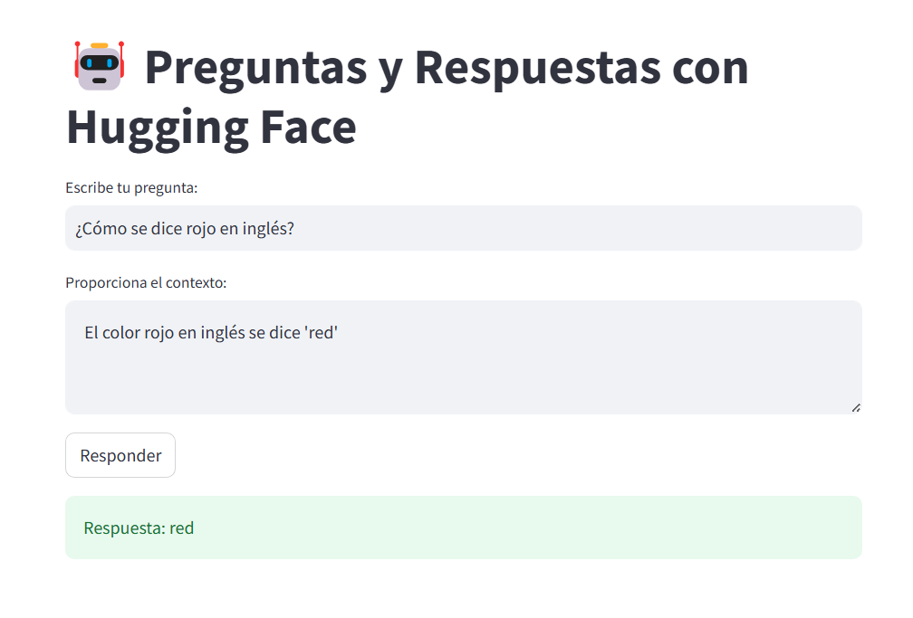
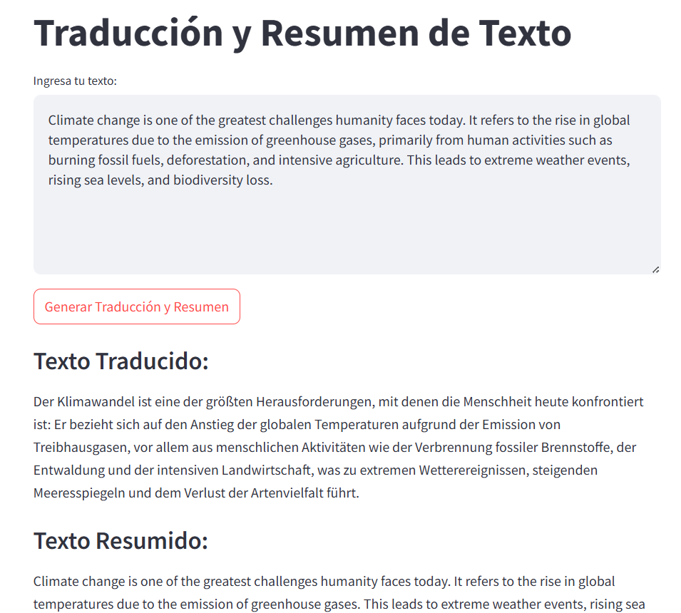

# 🤖 Ejecucion de Modelos IA

¡Bienvenido! Este repositorio contiene tres proyectos desarrollados con modelos de Hugging Face:

1. 🧠 **Aplicación de Preguntas y Respuestas**.
2. 🔄 **Iteración entre múltiples modelos LLM**.
3. 🖼️ **Detección de objetos usando un modelo local**.

---

## 🚀 Instalación y Uso

### Requisitos
- Python 3.9+
- pip
- Librerías detalladas en `requirements.txt`.

### Instalación

```bash
git clone https://github.com/usuario/huggingface-projects.git

cd huggingface-projects

python -m venv env

.\env\Scripts\activate

pip install -r requirements.txt
```

## 📚 Descripción de los Proyectos y su ejecución

### 🧠 Proyecto 1: Aplicación de Preguntas y Respuestas
**Objetivo:** Crear una aplicación que permita al usuario realizar preguntas y recibir respuestas utilizando modelos de Hugging Face.


#### Ejecutar
```bash
streamlit run proyecto1/app.py
```



### 🔄 Proyecto 2: Iterar entre Múltiples Modelos
**Objetivo:** Implementar múltiples modelos y permitir la iteración entre ellos mediante una clase. 
En este caso un modelo de traducción de ingles a frances y un modelo de resumen de texto.

#### Ejecutar
```bash
streamlit run proyecto2/multi_model.py
```



### 🖼️ Proyecto 3: Modelo Local
**Objetivo:** Ejecutar un modelo localmente, como identificación de objetos en imágenes.
#### Ejecutar
```bash
python proyecto3/object_detection.py
```


## Sección Especial: Transformers y Modelos Locales

### 🤔 ¿Qué son los Transformers?

Los transformers son una arquitectura de red neuronal que ha revolucionado el procesamiento del lenguaje natural y otras áreas. Se basan en mecanismos de atención que permiten a los modelos enfocarse en diferentes partes de los datos de entrada.


## Validación de Recursos

**Memoria requerida:** Depende del modelo. Por ejemplo:

`bert-base-uncased: ~440MB.`
`gpt-neo: ~1.2GB.`

**Cálculo:** (número de parámetros * tamaño de flotante). Ejemplo:
Un modelo con 110M de parámetros y flotantes de 32 bits: `110e6 * 4 bytes = 440MB.`

---

### 🛠️ Configuración Local

Para usar modelos localmente:

1. Descarga el modelo desde Hugging Face:

    ```bash
    transformers-cli download <modelo>
    ```

2. Carga el modelo en tu script:

    ```python
    from transformers import AutoModel
    model = AutoModel.from_pretrained('ruta_a_modelo_local')
    ```